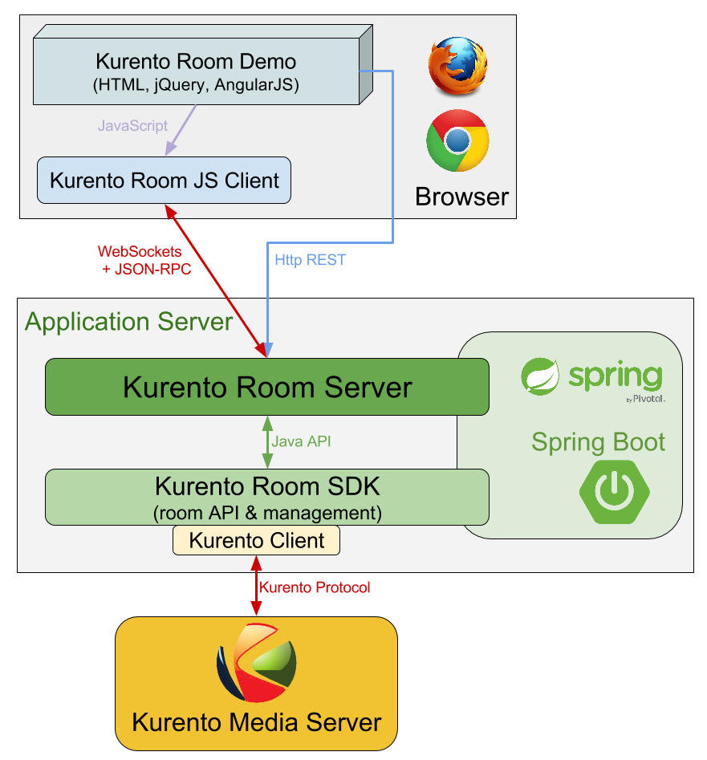

.. image:: images/kurento-rect-logo3.png
   :alt:    Kurento logo
   :align:  center

|
|

%%%%%%%%%%%
Description
%%%%%%%%%%%

This project is a framework that was developed using Kurento Media Server and 
WebRTC. Its main goal is to aid programmers when implementing applications for 
multimedia group communications.  
 
A demonstration application is available that makes use of this API to enable 
users to simultaneously establish multiple connections to other users connected 
to the same session or room.

The core module is the Room SDK but the developers can pick whatever component
they need from the framework in order to build their application.

For example, some might need only small modifications on the client side but
others will want to inject their logic on server side and might even have to
modify the SDK.

..
   Image source:
   https://docs.google.com/a/naevatec.com/drawings/d/1I3Upj-vMlEtBkt0InWNKQ2ChpzhoS73wf7dgvDqcjug/edit?usp=sharing

   *Kurento Room components*

Integration
-----------

These are some of the design and architecture requirements that an application 
has to fulfill in order to integrate the Room API:

- include the SDK module to its dependencies list
- create one of the two `RoomManager` types as a singleton instance by 
  providing implementations for the following interfaces: 

  - ``RoomEventHandler``
  - ``KurentoClientProvider``

- develop the client-side of the application for devices that support WebRTC
  (*hint:* or use our **client-js** library and take a look at the demo's client 
  implementation)
- design a room signaling protocol that will be used between the clients and
  the server (*hint:* or use the WebSockets API from ``kurento-room-server``) 
- implement a handler for clients' requests on the server-side, that will
  use the ``RoomManager`` to process these requests (*hint:* JSON-RPC handler
  from ``kurento-room-server``)
- choose a response and notification mechanism for the communication with the
  clients (*hint:* JSON-RPC notification service from ``kurento-room-server``)

About the technology stacks that can or should be used to implement a Rooms 
application: 

- WebSockets for the communications between the server and the clients
- Spring and Spring Boot for the easy configuration and integration with some 
  of Kurento's modules. It also provides a WebSockets library.

And of course, the main requirement is at least one installation of the Kurento
Media Server, accessible to the room application.